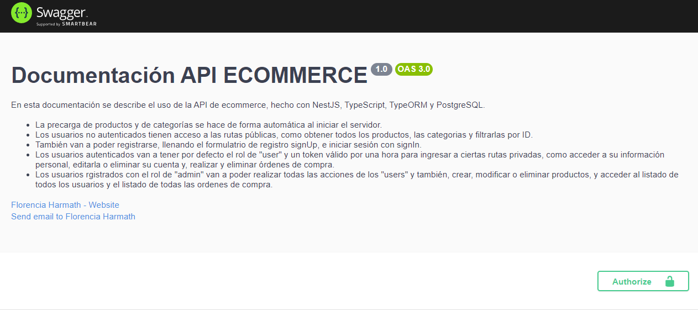
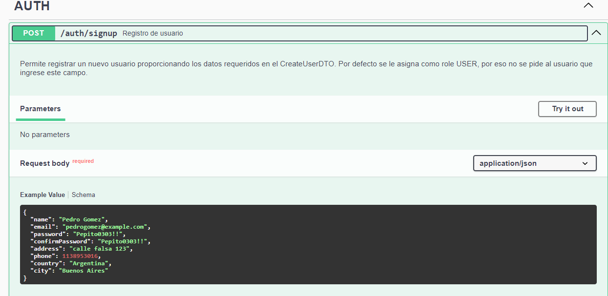
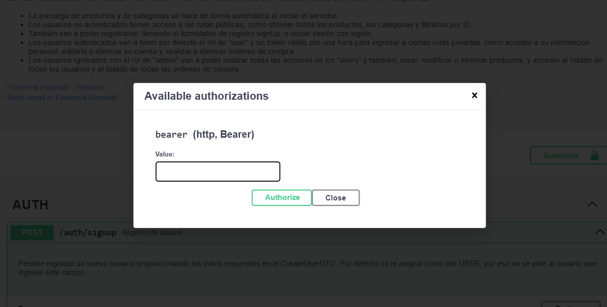
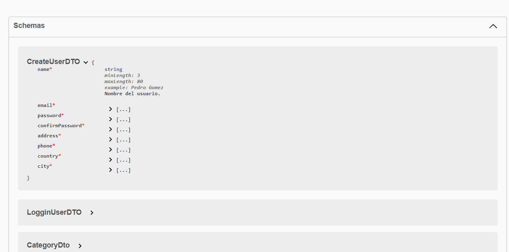

# Ecommerce Backend API

Este proyecto es la lógica backend de un ecommerce, construido con tecnologías modernas y robustas como NestJS, TypeScript, TypeORM, PostgreSQL, Swagger, Bcrypt, JWT y cloudinary. A continuación, se detalla la funcionalidad y las tecnologías utilizadas.

## Tabla de contenidos 

1. [Tecnologías](#tecnologías)
2. [Funcionalidades](#funcionalidades)
3. [Autenticación](#autenticación)
4. [Documentación](#documentación)
5. [Precarga](#precarga)
6. [Estructura](#estructura)
7. [Instalación](#instalación)
8. [Requerimientos](#requerimientos)

## Tecnologías 

- **NestJS**: Framework utilizado para construir alplicaciones de servidor escalables y mantenibles.
- **TypeScript**: Lenguaje que proporciona tipos estáticos, mejorando la seguridad y mantenibilidad del código.
- **TypeORM**: ORM utilizado para la interacción con la base de datos de manera eficiente.
- **PostgreSQL**: Base de datos relacional utilizada para almacenar la información.
- **Swagger**: Utilizado para la documentación de la API.
- **JWT (JSON Web Token)**: Biblioteca para manejar tokens de autenticación.
- **Bcrypt** : Bbiblioteca para encriptar las contraseñas.
- **Cloudinary**: Almacenamiento en la nube para fotos y videos.

## Funcionalidades

- **Usuarios no autenticados (invitados)**
  - Ver el listado de productos.
  - Acceder a los detalles del producto mediante su ID.
  - Registrarse en la aplicación.

- **Usuarios Registrados (users)**
  - Loguearse, obteniendo como rol predeterminado 'user'.
  - Acceder a su información personal (getUserById).
  - Realizar órdenes de compra.
  - Modificar y eliminar su cuenta.

- **Administradores (admins)**
  - Realizar todas las acciones de un 'user'.
  - Crear, modificar y eliminar productos.
  - Ver la lista de todos los usuarios.
  - Ver todas las órdenes de compra.

## Autenticación 

**Regitro y autenticación**
 - **SignUp**: Encripta la contraseña utilizando Bcrypt
 - **SignIn** : Genera un token JWT con una duración de una hora para autenticar las sesiones de los usuarios.

 **Protección de rutas**
 - **AuthGuard**: Verifica que el usuario esté autenticado mediante un token válido.
 - **RoleGuard**: Asegura que el usuario tenga el rol necesario para acceder a ciertas rutas.

 ## Documentación

La API está completamente documentada utilizando Swagger, facilitando la comprensión y el uso de la API tanto para desarrolladores como para testers.

## Precarga

Al iniciarse el servidor, se utiliza una precarga de categorías y productos en la base de datos si no existen, garantizando que simpre haya datos disponibles para la iteracción inicial
  
## Requerimientos

- Node.js (v14 o superior)
- PostgreSQL

## Instalación

1. Clona el repositorio:
- git clone https://github.com/tu_usuario/tu_repositorio.git
- cd tu_repositorio

2. Instala las dependencias: bash
- npm install

3. Configura las variables de entorno
   -Crea un archivo .development.env y añade las siguientes variables:
   -Ten en cuenta que por seguridad, las debes guardar tus datos en variables de entorno
   **DATABASE_HOST**=localhost
   **DATABASE_PORT**=5432
   **DATABASE_USERNAME**=tu_usuario
   **DATABASE_PASSWORD**=tu_contraseña
   **DATABASE_NAME**=tu_base_de_datos
   **CLOUDINARY_CLOUD_NAME**=tu_nombre_cloudinary
   **CLOUDINARY_API_KEY**=tu_api_key_cloudinary
   **CLOUDINARY_API_SECRET**=tu_api_secreta_cloudinary
   **JWT_SECRET**=tu_secreto_jwt

4. Inicia el servidor
- npm run start

## Estructura 

 Para mantener el código organizado y modular, he utilizado un esquema de scaffolding basado en entidades. Esto significa que todas las funcionalidades relacionadas con una entidad específica están agrupadas en su propia carpeta. Este enfoque facilita la escalabilidad y el mantenimiento del proyecto. Mantiene el código limpio y organizado facilitando la navegación y comprensión del proyecto. Permite añadis nuevas funcionalidades o entidades sin complicar a estructura del proyecto y facilita la identificación y solución de problemas.

